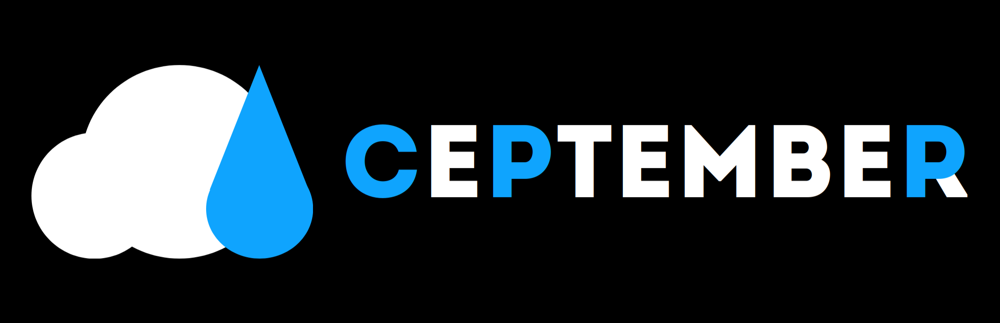

Для работы с static файлами вы должны закинуть их в папку static 
Для основной страницы файлы (html; css; js) нужно закинуть в корень 
Для других страниц, в чатсности это касается только index.html существует соглашение, что как называется ендпоинт для загрузки страницы, так же должна называться папка
(Пример: по ендпоинту /uploadVideo мы хотим загружать страницу. То папка для файлом index.html должна называться uploadVideo)
Для файлов js css существует лишь одно правило - уникальные имена для каждого из них. 